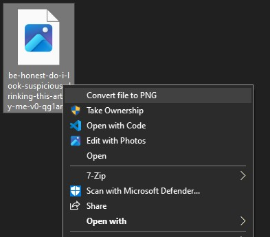

# Convert2PNG

*A simple file converter that converts a wide amount of files to PNG from within the windows file explorer*

The list of supported file types can be found [here](https://imagemagick.org/script/formats.php) (it's hundreds of formats)

--- 

## TODO
* Add some feedback when software processing takes a while (progressbar)

## Update Notes

#### V1.0.0-BETA
* Base software
* Prompts to download extra components on specific file types
* Shows crash information with easy way to submit error
* Installer registers software with file explorer
